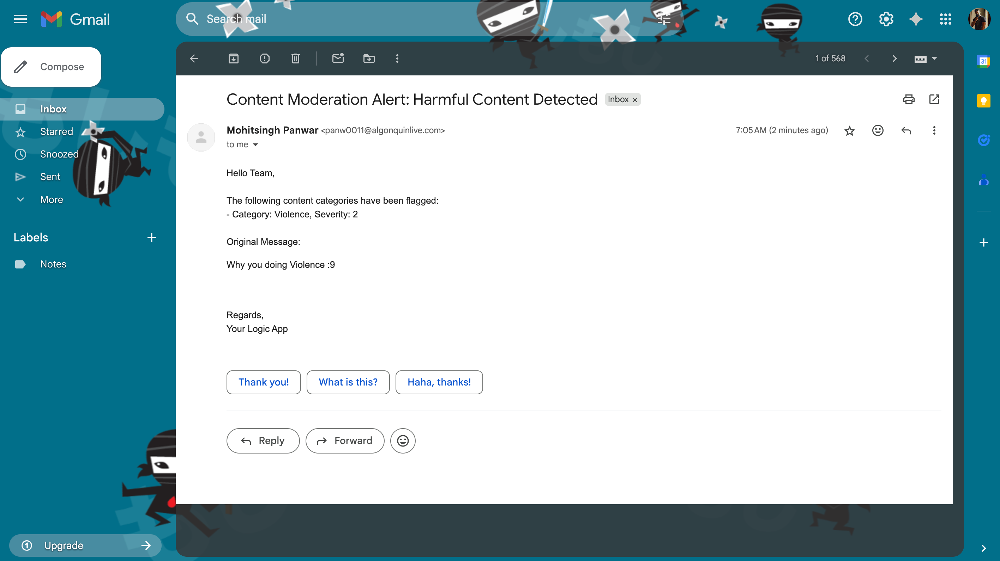
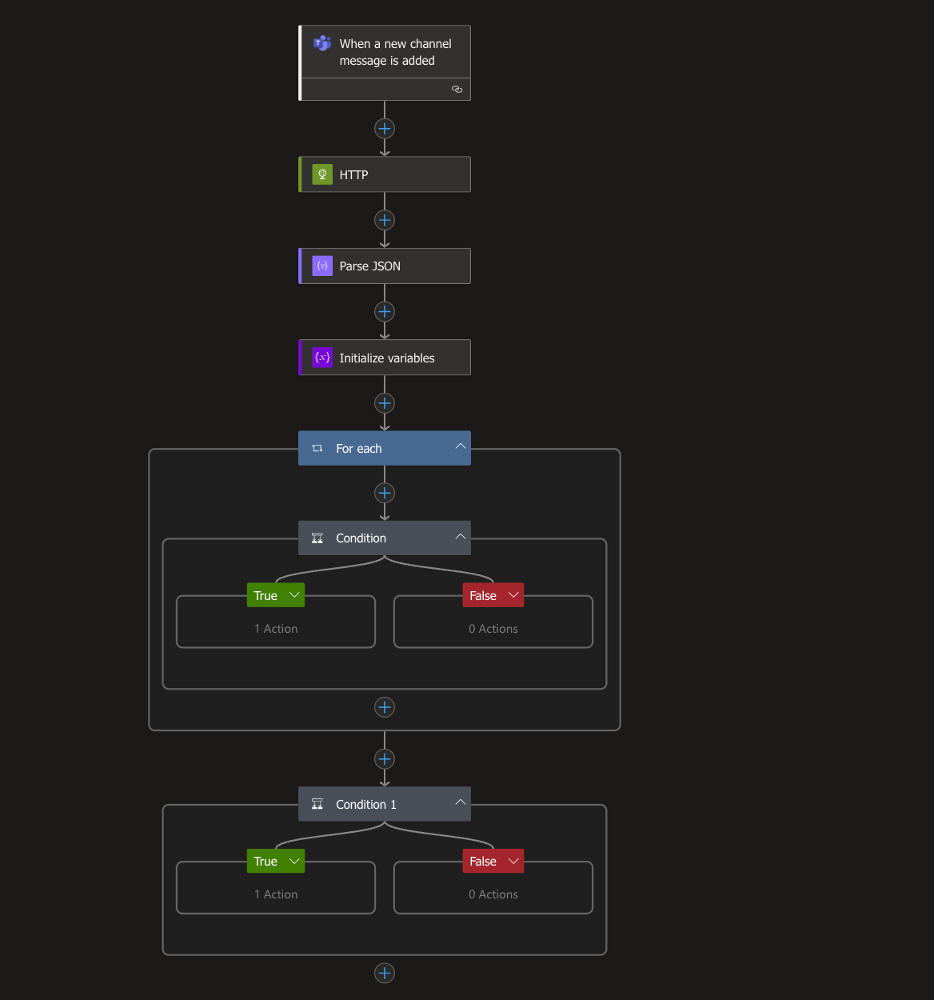
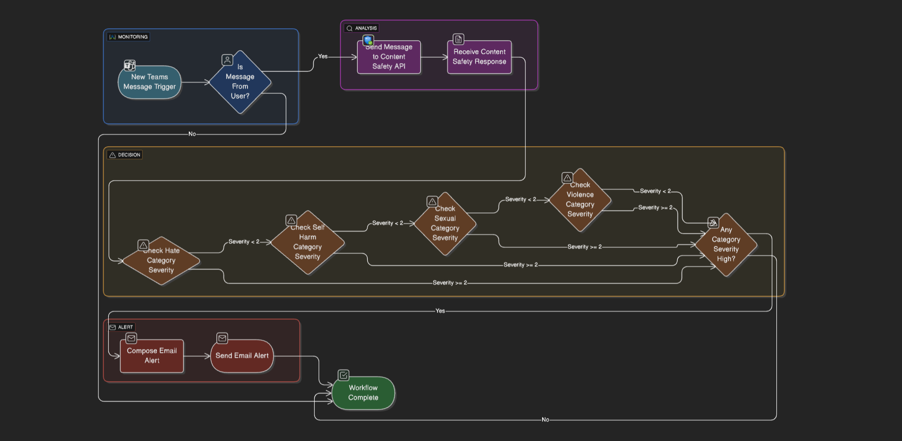

# 🛡️ Teams Chat Content Moderation using Azure Logic Apps

This project implements a **real-time content moderation system** for Microsoft Teams using **Azure Logic Apps** and **Azure AI Content Safety API**. It monitors channel messages, analyzes them for harmful content (e.g., hate speech, violence, self-harm, sexual content), and sends email alerts when flagged content is detected.

---

## 🚀 Features

- ✅ Monitors a Microsoft Teams channel for new messages
- 🧠 Uses Azure Content Safety API to analyze message content
- ⚠️ Flags content categories: **Hate, SelfHarm, Sexual, Violence**
- ✉️ Sends moderation alert emails for messages with **severity ≥ 2**

---

## 🛠️ Technologies Used

- Azure Logic Apps
- Azure Content Safety (AI service)
- Microsoft Teams Connector
- Office 365 Outlook Connector
- JSON parsing and conditional logic
- Optional: Azure Key Vault for securing secrets

---

## 📸 Screenshots

### ✅ Alert Email Received


### 🧠 Logic App Workflow Executed


### 🛠️ Logic App Designer View


---

## 🔧 Setup Instructions

### 1. 🏗️ Provision Required Azure Resources

- [ ] Azure Logic App (Consumption Plan)
- [ ] Azure Content Safety Resource
- [ ] Microsoft Teams account & test channel
- [ ] Office 365 Outlook account for email notifications

### 2. 🔑 Get Content Safety API Credentials

- Go to Azure Portal > Your Content Safety resource
- Copy the **Endpoint** (e.g., `https://<resource>.cognitiveservices.azure.com/`)
- Copy one of the **Keys** (Key1 or Key2)

### 3. 🔄 Configure Logic App Connections

- **Teams connector**: Trigger on new channel message
- **HTTP action**: Call Azure Content Safety API with:
  - URI:  
    ```
    https://<your-resource>.cognitiveservices.azure.com/contentsafety/text:analyze?api-version=2024-09-01
    ```
  - Header:  
    ```
    Ocp-Apim-Subscription-Key: <your-key>
    ```
  - Body:
    ```json
    {
      "text": "@{triggerBody()?['body']?['content']}",
      "blocklistNames": [],
      "categories": ["Hate", "SelfHarm", "Sexual", "Violence"],
      "outputType": "FourSeverityLevels"
    }
    ```

- **Email action**: Use Office 365 connector to send to your desired email.

---

## 📥 How It Works

```plaintext
Teams Message → HTTP POST to Azure Content Safety →
   Parse JSON → Check category severity →
   If severity ≥ 2 → Send email to moderator
```

---

## 🧪 Testing Instructions

1. Post a message to the monitored Teams channel:
   - Example trigger: `I hate you`, `I'm going to hurt someone`
2. Wait for Logic App to trigger (within 1 minute).
3. Check:
   - Email inbox for alert
   - Logic App run history for results

✅ You can also **hardcode test values** in the Logic App during development.

---

## 📎 Sample Alert Email

**Subject:** `Content Moderation Alert: Harmful Content Detected`

**Body:**
```html
Hello Team,

The following content categories have been flagged:
- Category: Hate, Severity: 3

Original Message:
I hate everyone in this chat.

Regards,
Your Logic App
```

---

## 🔐 Security Tips

- Store API keys in **Azure Key Vault** (instead of hardcoding)
- Use **role-based access control (RBAC)** for secure Logic App access
- Monitor Logic App executions for usage anomalies

---

## 📂 Project Files

| File | Description |
|------|-------------|
| `logicapp-definition.json` | Exported Logic App definition |
| `README.md` | Project documentation |
| `1.png` | Sample alert email |
| `2.png` | Logic App workflow run |
| `3.png` | Logic App designer view |

---

## 🎥 Demo Video

Watch the full working demo here:  
📺 [https://youtu.be/ZAjTICyfKeQ](https://youtu.be/ZAjTICyfKeQ)

---
